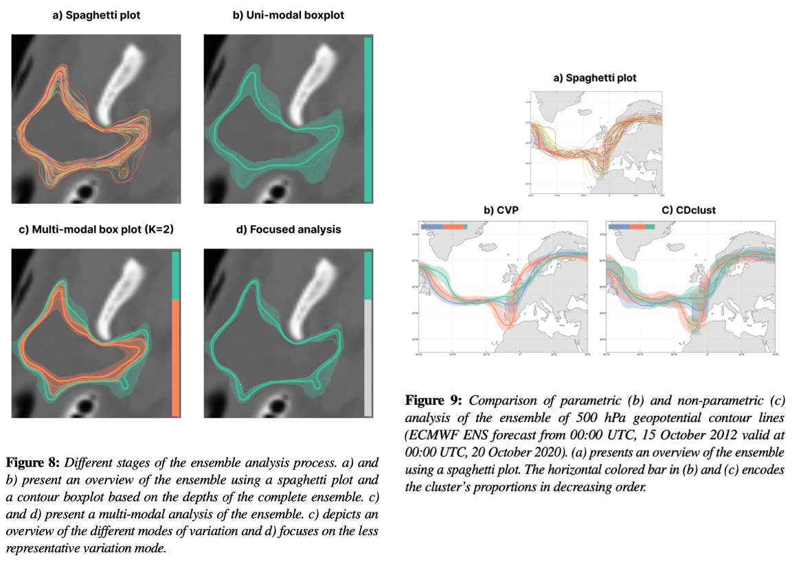

# Depth for Multi-Modal Contour Ensembles

[](https://opensource.org/licenses/MIT)

This repository contains the code for the paper:
> Chaves-de-Plaza, N.F., Molenaar, M., Mody, P., Staring, M., van Egmond, R., Eisemann, E., Vilanova, A. and Hildebrandt, K. (2024), Depth for Multi-Modal Contour Ensembles. Computer Graphics Forum, 43: e15083. https://doi.org/10.1111/cgf.15083



If you use our code in your publications, please consider citing:
```
@article{https://doi.org/10.1111/cgf.15083,
	author = {Chaves-de-Plaza, N.F. and Molenaar, M. and Mody, P. and Staring, M. and van Egmond, R. and Eisemann, E. and Vilanova, A. and Hildebrandt, K.},
	journal = {Computer Graphics Forum},
	number = {3},
	pages = {e15083},
	title = {Depth for Multi-Modal Contour Ensembles},
	volume = {43},
	year = {2024},
    doi={https://doi.org/10.1111/cgf.15083}}
```

[Link to paper](https://onlinelibrary.wiley.com/doi/10.1111/cgf.15083?af=R)

Also, consider checking the paper where we introduce the [Inclusion Depth for Contour Ensembles](https://graphics.tudelft.nl/inclusion-depth-paper). And, if you want to integrate contour depth in your project, check out the [`contour-depth` Python package](https://graphics.tudelft.nl/contour-depth).

## Setup
1. Install a conda (we recommend using [miniconda](https://docs.conda.io/projects/miniconda/en/latest/))
2. Create environment: `conda create --name=multimodal-depth python=3.9`
3. Activate environment: `conda activate multimodal-depth`
4. Install dependencies with pip: `pip install -r requirements.txt`
5. To test installation, from the root of the repository run `python experiments/test_experiments_imports.py`. No errors should be raised.

## Replicating the paper results
The scripts in the `experiments` directory permit replicating the paper's results.
Each script corresponds to a figure or table in the paper. Each script generates its data, results, and figures or tables. The script saves these outputs to a directory with the same name in the `experiments` directory. For instance, running the command `python clustering_differences.py` results in a directory `experiments/clustering_differences`.
Data for the case studies is available from the authors upon request. 

## License and third-party software
The source code in this repository is released under the MIT License. However, all used third-party software libraries are governed by their own respective licenes. Without the libraries listed in `requirements.txt`, this project would have been considerably harder.
